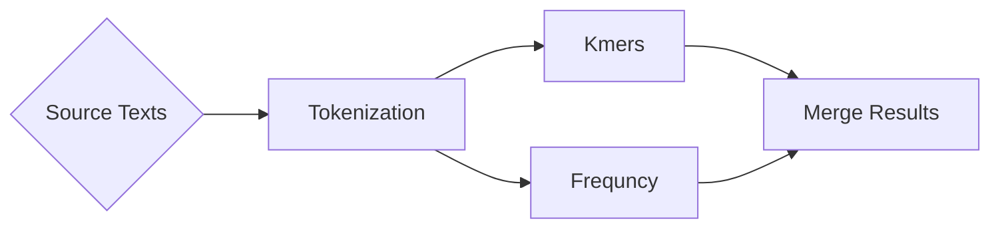

# nextflow-exercises

All exercises for the seminar Workflows for Scientific Data Analysis with Nextflow.

All workflow scripts are under the `workflow` directory, while the python scripts which are
actually doing the logic are under `lib`.

Results are written into `results`.

# Sample Project

## Overview

## Results of running nextflow pipelines

| Pipeline   | URL                                       | Deployability | Docker | Reason                                      |
| ---        | ---                                       | ---           | ---    | ---                                         |
| RNA-seq    | https://github.com/nextflow-io/rnatoy     | S             | Ubuntu | -                                           |
| RNA-seq    | https://github.com/nextflow-io/rnaseq-nf  | S             | Debian | -                                           |
| MTA-NF     | https://github.com/cbcrg/mta-nf           | F             | Debian | Outdated links for downloading dependencies |
| AMPA-NF    | https://github.com/cbcrg/ampa-nf          | MiP           | Debian | Missing Perl dependencies                   |
| cegwas2-nf | https://github.com/AndersenLab/cegwas2-nf | MaP           | -      | Conda environemnt needed, couldnt be set up |
| YAMP       | https://github.com/alesssia/YAMP          | MiP           | -      | Download of external database               |
| FA-nf      | https://github.com/anvlasova/FA-nf        | MiP           | -      | Download external data                      |
|            |                                           |               |        |                                             |

S: Success, instantly runnable
MiP: Minor Problems
MaP: Major Problems
F: Failure
